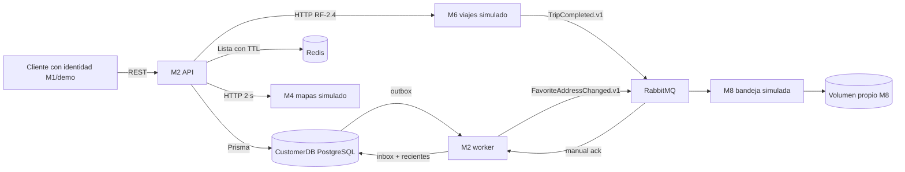

# Arquitectura y decisiones

API y worker pertenecen al mismo servicio lógico M2 y comparten únicamente su CustomerDB. Desplegarlos por separado desacopla la latencia HTTP de la entrega de eventos. Los simuladores reciben sólo las variables necesarias para HTTP/mensajería; no reciben la conexión de CustomerDB. La integración no realiza SQL cruzado.

## ADR-01 · Persistencia y propiedad

Se mantiene PostgreSQL con Prisma para evitar un cambio tecnológico injustificado. `Direccion`, `ViajeReciente`, `RevisionCliente`, `Idempotencia`, `Inbox`, `ViajeProcesado`, `Outbox` y `calificaciones` son de M2. `clienteId` y `viajeId` son referencias de contrato, no claves foráneas a otra DB. M6 es propietario de viajes y M8 de su bandeja.

Alternativa: leer tablas de TripDB directamente para recientes. Se descarta por acoplar esquemas y contradecir la separación requerida. Se elige un evento con snapshot mínimo de origen/destino. Una corrección posterior del viaje no se sincroniza automáticamente: requeriría un evento nuevo de corrección.

## ADR-02 · Sincronía y asincronía

El usuario necesita respuesta inmediata al buscar geocodificación; se usa REST, límite de 2 segundos y error 503 explícito. El M4 incluido tiene un catálogo fijo; no llama mapas reales ni consume cuotas. Puede guardarse una dirección con coordenadas conocidas aunque M4 esté caído.

Los recientes toleran un retraso breve tras completar un viaje. Se usa RabbitMQ para evitar que M6 dependa de la disponibilidad de M2. Una notificación de favorita tampoco forma parte del commit HTTP: se publica desde outbox. Alternativa descartada: llamar M8 síncronamente al guardar; un fallo de M8 haría fallar o demorar una escritura válida.

## ADR-03 · Caché, TTL e invalidación

Redis acelera consultas de listas; PostgreSQL conserva la verdad. Clave: `m2:direcciones:<SHA256(clienteId)>:v<revision>`. TTL configurable, 60 s por defecto. Cada modificación incrementa `RevisionCliente` en la misma transacción. GET consulta la revisión durable y usa esa versión en la clave. Tras commit se intenta borrar la clave anterior.

Un simple `DEL` después de escribir tiene una carrera: un lector atrasado puede repoblar datos viejos. La revisión durable impide que las lecturas posteriores usen esa clave aunque Redis estuviera caído al invalidar. Se acepta una consulta corta a la revisión por cada GET a cambio de consistencia más clara. Una lectura simultánea al commit puede observar la versión anterior, como cualquier operación que se superpone temporalmente; una lectura iniciada después del commit toma la revisión nueva.

No se usa Redis como única defensa contra duplicados: puede expirar, reiniciarse o fallar. En caída, las listas se consultan en PostgreSQL y las escrituras permanecen válidas. Cada clave anterior que quede sin borrar expira por TTL.

## ADR-04 · Concurrencia e idempotencia

Caso problemático: dos solicitudes verifican que no existe “Casa” y ambas insertan; o dos pantallas editan versión 1 y la última pisa la primera. Se combinan:

1. Unique `(clienteId, tipo, clave)` con coordenadas a seis decimales o hash del texto normalizado si no hay coordenadas.
2. Transacción SERIALIZABLE con hasta siete reintentos ante P2034/P2002.
3. If-Match/versión en PATCH y DELETE; conflicto 412 en lugar de sobrescribir.
4. Idempotencia por cliente + operación + clave, con huella canónica del payload. Resultado y efecto quedan en el mismo commit. Distinto payload con igual clave: 409.
5. Inbox por eventId y ViajeProcesado por viajeId, ambos en la misma transacción que los dos puntos y la revisión. Un eventId nuevo para el mismo viaje tampoco duplica usos.

Alternativa: lock distribuido en Redis. Agregaría vencimiento, fencing y complejidad innecesaria; la restricción y las transacciones locales bastan para este agregado. Las pruebas se ejecutan también sobre PostgreSQL 15 real; ver PRUEBAS.md.

## ADR-05 · Outbox y límites de entrega

Se guarda la dirección y el evento outbox atómicamente. El worker publica en canal con confirms y recién entonces marca `publicadoAt`. Si muere entre confirmar y marcar, publica nuevamente: entrega al menos una vez. Se elige consumidor idempotente; no se promete “exactly once” del transporte.

M8 de demostración tiene un archivo por eventId, escritura temporal y rename atómico; su único efecto observable es la bandeja. No representa entrega real de email/SMS ni garantiza fsync frente a corte de energía. Las colas son durables con mensajes persistentes; una única instancia local de RabbitMQ no ofrece alta disponibilidad. La transferencia de retry por TTL/DLX usa el comportamiento estándar de colas clásicas; para garantías reforzadas ante fallos del broker se requerirían quorum queues y dead-lettering at-least-once. No se afirma tolerancia a pérdida del disco.

## ADR-06 · Seguridad y observabilidad

Token de demo con sub, role, aud y exp, firmado HMAC; M2 valida firma y deriva el cliente. Se conserva RF-2.4 detrás de esa autenticación. No existe endpoint público de emisión: el script usa un secreto local. Reemplazar por validación de M1/OIDC al integrar el equipo. `INTEGRATION_SECRET` protege simuladores HTTP; RabbitMQ requiere usuario/clave. Para despliegues publicados hacen falta HTTPS, identidades de servicio y permisos de broker separados por productor/consumidor.

Logs nuevos en JSON: operación, estado, eventId y correlationId; no dirección, coordenadas ni tokens. Live indica que el proceso atiende. Ready devuelve 503 si falla PostgreSQL; Redis o worker ausentes producen estado `degraded` con HTTP 200 porque la API puede persistir y encolar. El heartbeat del worker expira en 10 s y se emite después de una iteración conectada a RabbitMQ.

## Retención y límites de esta entrega

Se conservan 20 recientes no favoritas por cliente y todas las favoritas; eventos atrasados no retroceden `ultimoUso`. Borrar una dirección no borra los viajes; un viaje nuevo puede generar ese lugar nuevamente. Inbox, outbox e idempotencia no tienen purga automática en esta demo: conservan trazabilidad y deduplicación durante toda la evaluación. Antes de producción se debe acordar horizonte de reenvío y retención, limitar favoritos por cliente, depurar respuestas con domicilios y establecer borrado de datos personales. Las claves hash de Redis son seudónimos, no anonimización.

## Fuentes técnicas

- [RabbitMQ: confirms y acknowledgements](https://www.rabbitmq.com/docs/confirms): confirmación del productor y del consumidor resuelven etapas distintas.
- [Prisma: transacciones](https://www.prisma.io/docs/orm/prisma-client/queries/transactions): aislamiento y reintento ante conflictos.
- [Redis: EXPIRE](https://redis.io/docs/latest/commands/EXPIRE/): vencimiento de estado efímero.
- [PGlite Socket](https://www.npmjs.com/package/@electric-sql/pglite-socket): límite de concurrencia multiplexada del entorno alternativo de pruebas.

## Reutilización RF-2.4 → RF-2.2 (v2.2.0)

Se comparte el cliente HTTP de M6, su URL y manejo de fallos. RF-2.2 conserva direcciones textuales y parejas de viajes propios completados; su endpoint de sugerencias propone B → A y permite usar cualquier dirección para ambos extremos. No requiere calificar ni inventa coordenadas. Los datos se guardan en CustomerDB para consulta sin M6/Internet. Ver INTEGRACION-M6.md para configuración, límites del contrato recibido y política de fechas.
