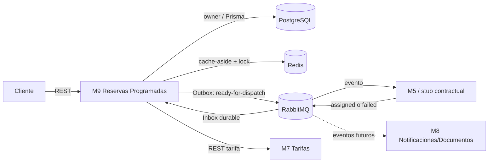

# Arquitectura AE2 — M9

## Componentes



PostgreSQL es la fuente de verdad. Redis acelera lecturas y coordina trabajo efímero. Los
servicios intercambian información únicamente por HTTP o RabbitMQ; M9 no lee tablas ajenas.

## Recorrido crítico

```mermaid
sequenceDiagram
  participant S as Scheduler M9
  participant R as Redis
  participant P as PostgreSQL
  participant O as Outbox Worker
  participant Q as RabbitMQ
  participant D as M5 / Stub

  S->>R: adquirir lock reserva (TTL/token)
  S->>P: UPDATE PROGRAMADA→ACTIVANDO condicional
  P-->>S: reserva + Outbox PENDING (misma transacción)
  S->>R: liberar lock si conserva token
  O->>P: leer Outbox PENDING
  O->>Q: reservation.ready-for-dispatch.v1 (correlationId)
  Q-->>O: publisher confirm
  O->>P: marcar PUBLISHED
  Q->>D: entregar evento
  D->>Q: ride-request.assigned.v1
  Q->>P: INSERT Inbox eventId + ACTIVANDO→ACTIVADA
  Note over Q,P: una transacción; duplicados no repiten el efecto
  alt error transitorio
    Q->>Q: retry queue TTL → main queue
  else límite agotado
    Q->>Q: DLQ
  end
```

## Decisiones importantes

- La transición SQL condicional es la garantía definitiva si el lock Redis expira.
- Outbox evita el dual-write DB/broker; Inbox evita efectos repetidos.
- REST M5 se conserva como compatibilidad, pero `DISPATCH_MODE=events` evita duplicar el
  efecto en Compose.
- El stub M5 permite demostrar AE2; no pretende modificar el contrato oficial de M5.
