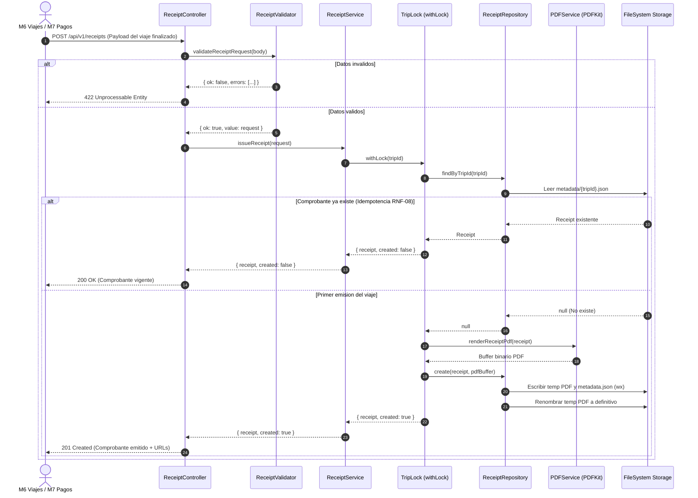

# Arquitectura y Diagrama de Componentes - Módulo 8 (Comprobantes PDF)

**Grupo 6:** Juan Gualtieri, Lucas Cremarchi, Meza Santiago  
**Módulo:** M8 - Notificaciones, Documentos y Soporte  
**Alcance Asignado:** RF-8.3 (Comprobante PDF) y RF-8.4 (Reenvío de Comprobante)  
**Instancia:** AE1 (Base funcional e inmersión)

---

## 1. Diagrama de Componentes del Microservicio

```mermaid
graph TD
    subgraph Clientes Externos
        M6[M6 - Viajes y Ciclo de Vida]
        M7[M7 - Tarifas y Pagos]
        DOC[Docente / Alumno / Swagger UI]
    end

    subgraph M8 Microservicio de Comprobantes [m8-documentos :3008]
        HTTP[HTTP Express Router /api/v1]
        
        subgraph Capa de Rutas y Documentacion
            R_REC[/receipts : Routes]
            R_DOC[/docs : Swagger UI OpenAPI]
            R_HLT[/health : HealthCheck]
        end

        subgraph Capa de Controladores y Validadores
            CTRL[Receipt Controller]
            VAL[Receipt Validator]
        end

        subgraph Capa de Servicios y Logica de Negocio
            SRV[Receipt Service]
            LOCK[In-Memory Trip Lock]
            PDF_SRV[PDFKit Render Service]
        end

        subgraph Capa de Persistencia e Infraestructura
            REPO[Receipt Repository]
            FS_META[(storage/receipts/metadata/*.json)]
            FS_PDF[(storage/receipts/pdf/*.pdf)]
        end
    end

    M6 -->|POST /receipts viaje finalizado| HTTP
    M7 -->|Datos de tarifa y pago| HTTP
    DOC -->|GET /docs / GET /receipts/:tripId/pdf| HTTP

    HTTP --> R_REC
    HTTP --> R_DOC
    HTTP --> R_HLT

    R_REC --> CTRL
    CTRL --> VAL
    CTRL --> SRV

    SRV --> LOCK
    SRV --> PDF_SRV
    SRV --> REPO

    REPO --> FS_META
    REPO --> FS_PDF
```

---

## 2. Diagrama de Secuencia: Emisión Idempotente de Comprobante (RF-8.3)



---

## 3. Aislamiento y Propiedad de Datos (RNF-04)

* El microservicio `m8-documentos` es dueño exclusivo del almacenamiento de comprobantes.
* Ningún otro módulo accede directamente al sistema de archivos de M8.
* En **AE1**, se persiste en sistema de archivos local (`storage/receipts/metadata` y `storage/receipts/pdf`).
* En **AE2**, esta persistencia evolucionará hacia `CommunicationsDB` (PostgreSQL) para metadatos y almacenamiento de objetos S3/MinIO para los archivos PDF, manteniendo intacto el contrato público de la API.

---

## 4. Usabilidad e Interfaces (RNF-12)

* **Naturaleza del Módulo 8:** M8 es un microservicio backend de procesamiento y generación de documentos. La interacción de usuario final (solicitar viaje, aceptar, ver estado) es responsabilidad de las interfaces de cliente (M2), conductor (M3) y despacho (M5/M6).
* **Evidencias interactivas de M8:** Para evaluación, demostración y pruebas, M8 provee:
  1. **Swagger UI interactivo (`/api/v1/docs`):** Permite emitir, consultar, reenviar y descargar comprobantes en vivo desde cualquier navegador web responsivo.
  2. **Descarga y visualización directa de PDF:** El PDF generado es responsive y se visualiza nativamente en cualquier visor de PDF móvil o de escritorio.
