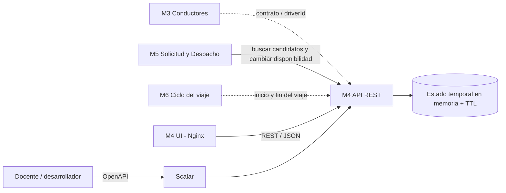
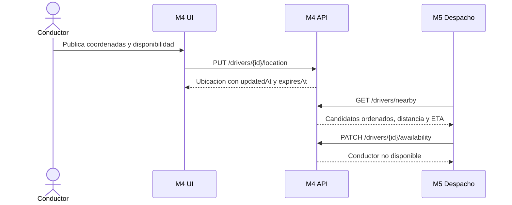

# Arquitectura del Modulo 4

## Diagrama de componentes

La UI y la API son aplicaciones y contenedores independientes. Nginx sirve los archivos de la UI y redirige las solicitudes `/api`, `/health` y `/docs` al contenedor de la API.

## Diagrama de secuencia del recorrido critico

## Caso concurrente

Dos actualizaciones del mismo conductor pueden llegar fuera de orden por latencia de red. Antes de guardar, M4 compara la marca temporal recibida con `updatedAt`. Si el mensaje es anterior, devuelve `409 STALE_LOCATION_UPDATE` y conserva la ubicacion mas reciente.
