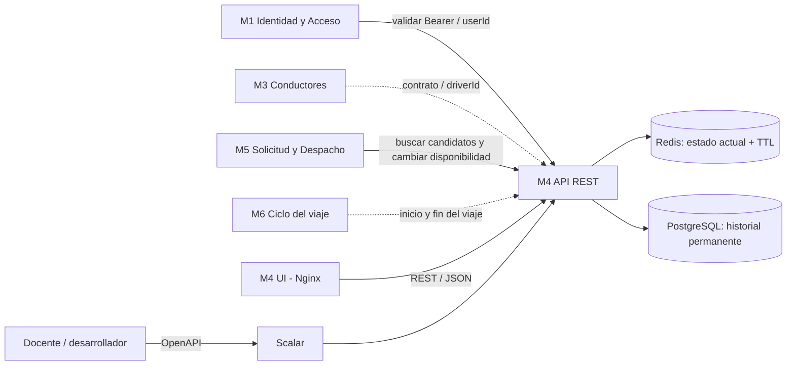
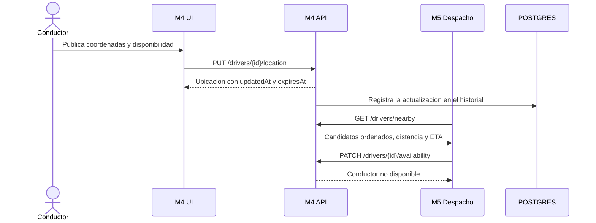

# Arquitectura del Modulo 4

## Diagrama de componentes

```mermaid
flowchart LR
  M1[M1 Identidad y Acceso] -->|validar Bearer / userId| API[M4 API REST]
  M3[M3 Conductores] -. contrato / driverId .-> API
  M5[M5 Solicitud y Despacho] -->|buscar candidatos y cambiar disponibilidad| API[M4 API REST]
  M6[M6 Ciclo del viaje] -. inicio y fin del viaje .-> API
  UI[M4 UI - Nginx] -->|REST / JSON| API
  API --> REDIS[(Redis: estado actual + TTL)]
  API --> POSTGRES[(PostgreSQL: historial permanente)]
  DEV[Docente / desarrollador] -->|OpenAPI| SCALAR[Scalar]
  SCALAR --> API
```

La UI y la API son aplicaciones y contenedores independientes. Nginx sirve los archivos de la UI y redirige las solicitudes `/api`, `/health` y `/docs` al contenedor de la API.

## Diagrama de secuencia del recorrido critico

```mermaid
sequenceDiagram
  actor Conductor
  participant UI as M4 UI
  participant API as M4 API
  participant M5 as M5 Despacho

  Conductor->>UI: Publica coordenadas y disponibilidad
  UI->>API: PUT /drivers/{id}/location
  API-->>UI: Ubicacion con updatedAt y expiresAt
  API->>POSTGRES: Registra la actualizacion en el historial
  M5->>API: GET /drivers/nearby
  API-->>M5: Candidatos ordenados, distancia y ETA
  M5->>API: PATCH /drivers/{id}/availability
  API-->>M5: Conductor no disponible
```

## Caso concurrente

Dos actualizaciones del mismo conductor pueden llegar fuera de orden por latencia de red. Antes de guardar, M4 compara la marca temporal recibida con `updatedAt`. Si el mensaje es anterior, devuelve `409 STALE_LOCATION_UPDATE` y conserva la ubicacion mas reciente.

## Persistencia

Redis mantiene solamente el estado operativo vigente y elimina las ubicaciones al vencer el TTL. PostgreSQL guarda una fila por actualizacion aceptada en `driver_location_history`. La combinacion `driver_id` y `recorded_at` es unica para que repetir el mismo mensaje no duplique el historial.

## Identidad

`driverId` es el mismo `userId` entero de M1. En las operaciones propias del conductor, M4 reenvia el token Bearer a `GET /auth/validar-identidad-y-rol` de M1. Solo continua si la identidad es valida, el rol es `CONDUCTOR` y el identificador coincide con la URL.
