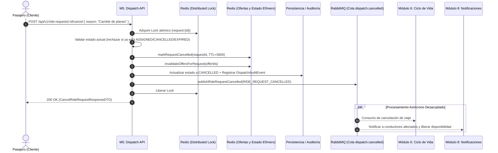
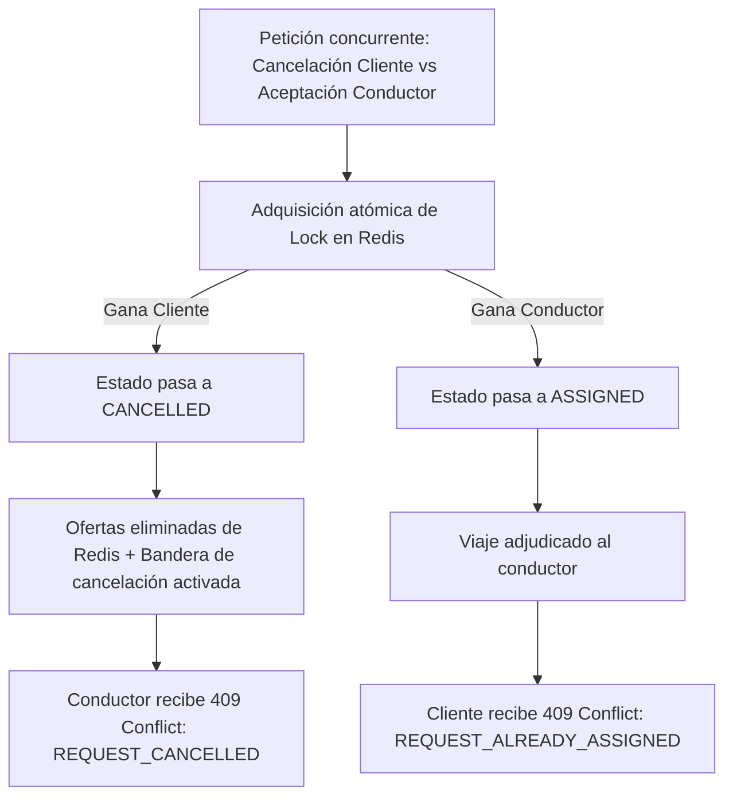

# Documentación Técnica — AE2 (Evolución Individual)
## Módulo 5: Servicio de Solicitud y Despacho
### Autor: Santino Mórtola (`colfredo32`)
### Requerimiento Asignado: RF-5.6 (Cancelación Previa de Solicitud de Viaje)

---

## 1. Introducción y Alcance (RF-5.6)

El requerimiento **RF-5.6 (Cancelación previa de solicitud de viaje)** permite que el pasajero/cliente anule su pedido de viaje antes de que se haya concretado la asignación definitiva a un conductor (es decir, durante las fases `PENDING`, `SEARCHING` o `OFFERED`).

En la evolución **AE1 → AE2 (Eje 3: Arquitectura y Comunicación entre Aplicaciones)**, la cancelación previa deja de ser una operación puramente en memoria y evoluciona hacia un flujo distribuido, asíncrono y resiliente, integrando:

1. **Redis (RNF-06):** Invalidación atómica inmediata de las ofertas emitidas que sigan activas y almacenamiento de bandera efímera de cancelación (`dispatch:request:{requestId}:cancelled`) con TTL para bloquear cualquier intento posterior de aceptación.
2. **RabbitMQ (RNF-07):** Publicación de eventos de dominio (`RIDE_REQUEST_CANCELLED`) a la cola `dispatch.cancelled` para notificar asíncronamente a:
   - **Módulo 6 (Viajes y Ciclo de Vida):** Cierre y consolidación del ciclo de vida del viaje.
   - **Módulo 8 (Notificaciones, Documentos y Soporte):** Aviso asíncrono a los conductores cuyas ofertas fueron revocadas, liberando su disponibilidad sin bloquear al cliente.
3. **Persistencia y Propiedad de Datos (RNF-04):** Transición de estado a `CANCELLED`, registro de timestamp (`cancelledAt`), motivo de cancelación (`cancellationReason`) y registro de auditoría inmutable (`DispatchAuditEvent`) sin borrados destructivos (`DELETE`).
4. **Concurrencia, Consistencia e Idempotencia (RNF-08, RNF-09, Criterio 7):** Sincronización atómica mediante locks distribuidos para resolver la condición de carrera crítica **"Cliente cancela vs. Conductor acepta simultáneamente"**.

---

## 2. Diagrama de Arquitectura y Secuencia de Cancelación



---

## 3. Tratamiento de Concurrencia y Carrera Crítica (Criterio 7)

### Escenario: Cliente cancela vs. Conductor acepta simultáneamente



* **Gana la cancelación:** Las ofertas en Redis son eliminadas inmediatamente y la solicitud se marca en Redis como `CANCELLED`. Cuando el hilo del conductor intenta ejecutar `respondToOffer`, consulta Redis/memoria y es rechazado con código `409 Conflict` (`REQUEST_CANCELLED`).
* **Gana la aceptación:** La solicitud queda marcada como `ASSIGNED`. Si el cliente intenta cancelarla, la validación de negocio detecta el estado asignado y rechaza la cancelación con código `409 Conflict` (`REQUEST_ALREADY_ASSIGNED`).

---

## 4. Endpoints y Contratos REST (OpenAPI 3.0 / Scalar)

### Cancelación Previa (RF-5.6)
* **Método y Ruta:** `POST /api/v1/ride-requests/:requestId/cancel` *(alias: `DELETE /api/v1/ride-requests/:requestId`)*
* **Headers:** `x-client-id: <clientId>` (o `Authorization: Bearer <token>`)
* **Request Body (Opcional):**
```json
{
  "reason": "Demora excesiva en la búsqueda"
}
```
* **Response `200 OK`:**
```json
{
  "requestId": "43f6efe3-372f-44ce-9f03-6c502691c28d",
  "clientId": "client_101",
  "status": "CANCELLED",
  "reason": "Demora excesiva en la búsqueda",
  "cancelledAt": "2026-10-01T00:15:30.000Z",
  "message": "Solicitud de viaje cancelada exitosamente por el cliente."
}
```

### Respuestas de Error:
* `400 Bad Request` (`VALIDATION_ERROR`): Si el motivo excede 255 caracteres o es de tipo inválido.
* `404 Not Found` (`RIDE_REQUEST_NOT_FOUND`): Si el ID de solicitud no existe.
* `409 Conflict` (`REQUEST_ALREADY_ASSIGNED`): Si el viaje ya fue tomado por un conductor.
* `409 Conflict` (`REQUEST_ALREADY_CANCELLED`): Si la solicitud ya fue cancelada previamente.
* `409 Conflict` (`REQUEST_EXPIRED`): Si la solicitud ya superó el tiempo máximo de búsqueda.

---

## 5. Instrucciones de Ejecución y Pruebas

### 1. Pruebas Automatizadas (Jest)
```powershell
cd modulo-5
# Ejecutar todas las pruebas unitarias e integración (116 tests):
npm test

# Ejecutar específicamente la suite de RF-5.6 (Redis + RabbitMQ + Concurrencia):
npm test -- tests/unit/rf-5.6-cancellation-redis-rabbitmq.unit.test.ts
```

### 2. Despliegue con Docker Compose (Multi-Contenedor)
```powershell
cd modulo-5
docker compose up --build -d
```
* **API M5:** `http://localhost:3005`
* **Health Check con diagnóstico:** `http://localhost:3005/health`
* **Documentación Scalar:** `http://localhost:3005/docs` (o `http://localhost:3006`)
* **Panel RabbitMQ Management:** `http://localhost:15672` (usuario: `guest`, clave: `guest`)
