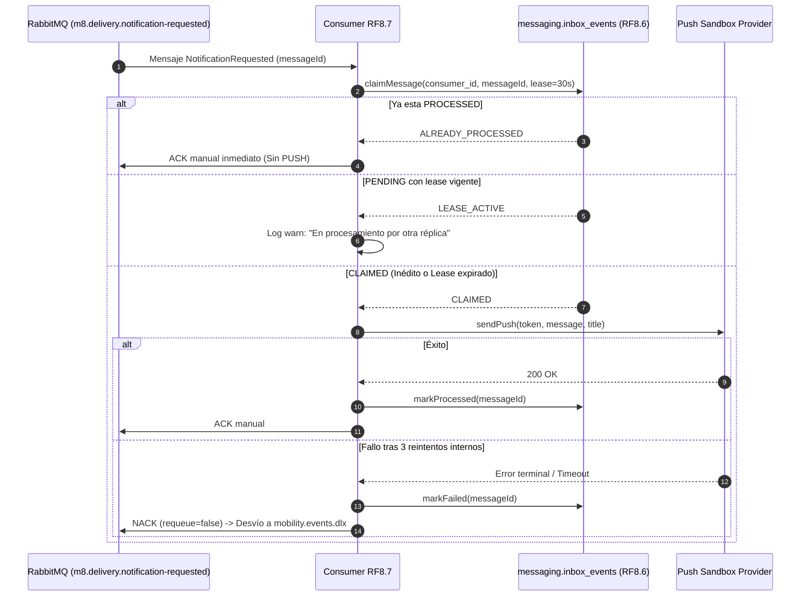

# ADR-001 (RF8.7): Estrategia de Idempotencia y Resiliencia en Entrega de Notificaciones

* **Estado:** Aceptado / Congelado (AE2 - Actualizado con acuerdos de integración)
* **Fecha:** 2026-10-05
* **Autor:** Santiago Meza (RF8.7 — Entrega de Notificaciones)
* **Requerimientos asociados:** RF-8.7, RF-8.6 (Mensajería compartida), RNF-07 (RabbitMQ), RNF-08 (Idempotencia), RNF-13 (Logs con correlación)

---

## 1. Contexto y Problema

El microservicio de Entrega de Notificaciones (**RF8.7**) actúa como consumidor asíncrono del evento `NotificationRequested` publicado en RabbitMQ por el Transactional Outbox de **RF8.1** a través del exchange compartido `mobility.events` (administrado por **RF8.6**).

En sistemas distribuidos con entrega *at-least-once*, pueden producirse mensajes duplicados o fallos en los que un consumidor cae antes de completar el PUSH:
1. No alcanza con una deduplicación ingenua de *"si existe messageId, emitir ACK"*: si un worker murió en estado `PENDING` antes de disparar el PUSH, otro consumidor debe poder recuperar el mensaje tras expirar el lease.
2. Un mensaje solo debe confirmarse con `ACK` inmediato sin re-envío PUSH cuando ya alcanzó el estado definitivo `PROCESSED`.

---

## 2. Decisiones de Diseño

### Decisión 1: Reutilización de `messaging.inbox_events` de RF8.6 con Lease
Para no duplicar infraestructura de Inbox técnico, RF8.7 reutiliza la tabla compartida de mensajería:
- **Consumer ID:** `m8.delivery.notification-requested`
- **Tabla:** `messaging.inbox_events` (propiedad técnica de RF8.6)
- **Campos:** `(consumer_id, message_id, event_type, status, lease_until, created_at, updated_at)`

**Lógica de Reclamo y Recuperación de Lease:**
1. **Mensaje inédito:** Inserta atómicamente con `status = 'PENDING'` y `lease_until = NOW() + 30 segundos`. Obtiene el claim y procede.
2. **Mensaje ya `PROCESSED`:** Se detecta de forma determinista que ya fue entregado exitosamente. Retorna `ACK` manual a RabbitMQ sin disparar un segundo push.
3. **Mensaje en `PENDING`:**
   - Si `lease_until > NOW()`: Otro consumidor lo está procesando activamente en vuelo. Se omite para evitar colisión concurrente.
   - Si `lease_until <= NOW()`: El consumidor anterior murió o se desconectó antes de finalizar. El nuevo consumidor recupera el claim extendiendo el lease (`lease_until = NOW() + 30s`) y ejecuta la entrega.

### Decisión 2: Reutilización de Topología y DLQ de RF8.6
- **Exchange:** `mobility.events` (Topic Exchange durable).
- **Dead Letter Exchange:** `mobility.events.dlx`.
- **Cola DLQ:** `dlq.notification.requested`.
- **Reintentos locales del Provider PUSH:** Ante errores transitorios de red (503 / timeout), RF8.7 ejecuta hasta un máximo de **3 intentos internos con backoff exponencial** (1x, 2x, 4x).
- **Tratamiento terminal:** Si los 3 reintentos fallan, el error se considera no recuperable en este ciclo. El estado se actualiza a `FAILED` en la base de datos y se emite `NACK(requeue=false)` para que RabbitMQ lo desvíe al DLQ de RF8.6 sin provocar loops infinitos de cola.

---

## 3. Diagrama de Secuencia del Flujo con Lease

