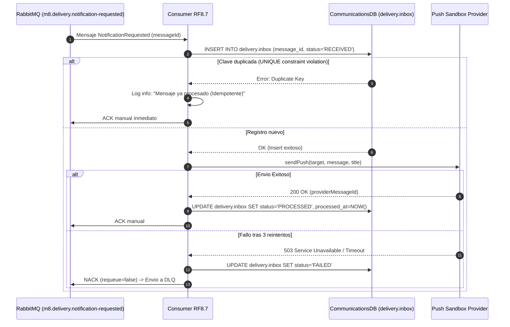

# ADR-001 (RF8.7): Estrategia de Idempotencia y Resiliencia en Entrega de Notificaciones

* **Estado:** Aceptado / Congelado (AE2)
* **Fecha:** 2026-10-04
* **Autor:** Santiago Meza (RF8.7 — Entrega de Notificaciones)
* **Requerimientos asociados:** RF-8.7, RNF-07 (RabbitMQ), RNF-08 (Idempotencia), RNF-13 (Logs con correlación)

---

## 1. Contexto y Problema

El microservicio de Entrega de Notificaciones (**RF8.7**) actúa como consumidor asíncrono del evento `NotificationRequested` publicado en RabbitMQ por el Transactional Outbox de **RF8.1** a través del exchange `mobility.events`.

En sistemas distribuidos basados en colas con entrega *at-least-once* (al menos una vez), pueden producirse entregas duplicadas del mismo mensaje debido a:
1. Caídas transitorias de red o reinicios de workers antes de procesar el `ACK`.
2. Reintentos automáticos del Outbox Relay de RF8.1 tras timeouts de confirmación.
3. Reprocesamiento manual o reactivación de colas.

**Impacto de negocio:** Si un mensaje duplicado no se filtra a nivel de transporte y entrega, el usuario final recibiría notificaciones push duplicadas (por ejemplo: dos avisos de "Tu conductor ha llegado" o dos avisos de "Viaje iniciado"), deteriorando gravemente la experiencia de usuario y consumiendo cuotas innecesarias ante proveedores externos de mensajería (FCM/APNs).

---

## 2. Decisiones de Diseño

### Decisión 1: Deduplicación Durable mediante Inbox Pattern con `messageId`
RF8.7 adoptará el patrón **Transactional Inbox** utilizando el identificador unívoco de mensaje (`messageId`) provisto en el sobre del evento:

1. El esquema de base de datos propio de RF8.7 (`delivery`) contendrá la tabla `delivery.inbox` con la restricción de unicidad:
   ```sql
   CREATE TABLE delivery.inbox (
       message_id VARCHAR(64) PRIMARY KEY,
       consumer_id VARCHAR(64) NOT NULL,
       event_type VARCHAR(64) NOT NULL,
       received_at TIMESTAMPTZ NOT NULL DEFAULT NOW(),
       processed_at TIMESTAMPTZ,
       status VARCHAR(32) NOT NULL DEFAULT 'RECEIVED'
   );
   ```
2. Antes de disparar el envío al proveedor de delivery, el worker registra atómicamente el `messageId` en `delivery.inbox`.
3. Si ocurre una violación de clave primaria (`duplicate key value violates unique constraint`), el sistema detecta de forma determinista que se trata de un mensaje duplicado ya recibido.

### Decisión 2: Tratamiento Idempotente de Mensajes Duplicados
Cuando se detecta un `messageId` duplicado:
- Se emite un log estructurado con severidad `INFO` indicando `DUPLICATE_MESSAGE_DETECTED`, incluyendo `messageId` y `correlationId`.
- **No se efectúa ningún despacho al proveedor PUSH.**
- Se emite un `ACK` manual inmediato a RabbitMQ (`channel.ack(msg)`). Esto libera el mensaje de la cola de RabbitMQ de forma segura, garantizando que el canal no se bloquee ni se reintente infinitamente.

### Decisión 3: Resiliencia ante Fallos del Proveedor y Dead Letter Queue (DLQ)
El despacho hacia el proveedor PUSH (sandbox o gateway externo) puede enfrentar indisponibilidad transitoria:
1. **Reintentos locales (In-process Retries):**
   - Ante errores transitorios (timeouts de red o códigos HTTP 500/503 del proveedor), RF8.7 ejecuta hasta un máximo de 3 intentos internos con backoff exponencial incremental (ej. 500ms, 1500ms, 4500ms).
2. **Fallos definitivos y Dead Letter:**
   - Si se agotan los reintentos o el error es fatal (error 400 por payload corrupto o credenciales no válidas):
     - Se actualiza el estado de la solicitud en `delivery.delivery_requests` a `FAILED`.
     - Se registra el detalle del error en `delivery.delivery_attempts`.
     - Se rechaza el mensaje con `NACK` sin reencolado (`channel.nack(msg, false, false)`), delegando el desvío a la Dead Letter Queue común configurada en RabbitMQ (`mobility.events.dlx` → `dlq.notification.requested`).

---

## 3. Diagrama de Secuencia del Flujo



---

## 4. Consecuencias y Beneficios

* **Entrega Exactly-Once lógica:** La combinación de Inbox + ACK inmediato en colisiones asegura que el usuario final nunca reciba notificaciones repetidas frente a redeliveries.
* **Trazabilidad y Observabilidad:** Cada mensaje queda registrado con su ciclo de vida en `delivery.inbox` y correlacionado con `correlationId` para depuración en producción.
* **Aislamiento de Errores:** Mensajes malformados o fallos persistentes del proveedor terminan en la DLQ sin impactar ni saturar el procesamiento del resto de las notificaciones del sistema.
