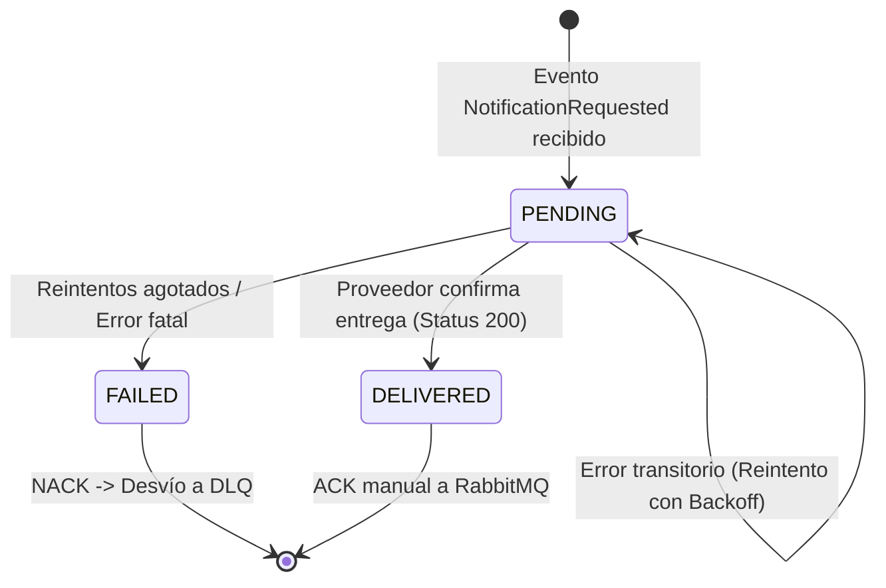

# ADR-002 (RF8.7): Persistencia, Propiedad de Datos y Ciclo de Vida de Delivery

* **Estado:** Aceptado / Congelado (AE2)
* **Fecha:** 2026-10-04
* **Autor:** Santiago Meza (RF8.7 — Entrega de Notificaciones)
* **Requerimientos asociados:** RF-8.7, RNF-04 (Propiedad de datos), RNF-08 (Idempotencia), RNF-13 (Observabilidad)

---

## 1. Contexto y Problema

El servicio de Entrega de Notificaciones (**RF8.7**) debe registrar cada solicitud de entrega recibida desde RabbitMQ, los intentos efectuados contra el proveedor PUSH (sandbox o real), las latencias y los estados finales de entrega.

De acuerdo con [`AGENTS.md`](file:///d:/Projects/p3-ae1-2026/AGENTS.md):
- Cada RF debe mantener ownership lógico estricto, preferentemente con un esquema propio en la base de datos compartida `CommunicationsDB`.
- Ningún servicio puede acceder directamente a tablas de otros servicios o módulos.
- Debe definirse cómo se comunica o registra el éxito o fallo del delivery para la integración final del sistema.

---

## 2. Decisiones de Diseño

### Decisión 1: Esquema Propio y Rol Dedicado en PostgreSQL (RNF-04)
Se define el esquema exclusivo `delivery` dentro de la base de datos `CommunicationsDB`, gestionado por el rol de base de datos `m8_delivery`:
- El script [`modulo-8/infra/postgres/init/02-notification-delivery.sh`](file:///d:/Projects/p3-ae1-2026/modulo-8/infra/postgres/init/02-notification-delivery.sh) crea el rol y asigna el esquema.
- El rol `m8_delivery` solo tiene permisos sobre las tablas del esquema `delivery`. No puede leer ni modificar las tablas de `receipts` ni de ningún otro módulo.

### Decisión 2: Modelo Relacional de Tablas

El esquema `delivery` consta de 3 tablas optimizadas para alta concurrencia y trazabilidad:

```sql
-- 1. Tabla de Inbox para deduplicación e idempotencia atómica
CREATE TABLE IF NOT EXISTS delivery.inbox (
    message_id VARCHAR(64) PRIMARY KEY,
    consumer_id VARCHAR(64) NOT NULL,
    event_type VARCHAR(64) NOT NULL,
    received_at TIMESTAMPTZ NOT NULL DEFAULT NOW(),
    processed_at TIMESTAMPTZ,
    status VARCHAR(32) NOT NULL DEFAULT 'RECEIVED'
);

-- 2. Registro maestro de solicitudes de delivery
CREATE TABLE IF NOT EXISTS delivery.delivery_requests (
    delivery_id UUID PRIMARY KEY DEFAULT gen_random_uuid(),
    notification_id UUID NOT NULL,
    message_id VARCHAR(64) NOT NULL UNIQUE,
    trip_id VARCHAR(64) NOT NULL,
    recipient_id VARCHAR(64) NOT NULL,
    event_type VARCHAR(64) NOT NULL,
    channel VARCHAR(32) NOT NULL DEFAULT 'PUSH',
    status VARCHAR(32) NOT NULL DEFAULT 'PENDING',
    title VARCHAR(255),
    message TEXT NOT NULL,
    target_destination VARCHAR(255),
    created_at TIMESTAMPTZ NOT NULL DEFAULT NOW(),
    updated_at TIMESTAMPTZ NOT NULL DEFAULT NOW()
);

CREATE INDEX IF NOT EXISTS idx_delivery_requests_notification_id 
    ON delivery.delivery_requests (notification_id);

CREATE INDEX IF NOT EXISTS idx_delivery_requests_trip_id 
    ON delivery.delivery_requests (trip_id);

-- 3. Historial de intentos individuales ante el proveedor (auditoría y SLA)
CREATE TABLE IF NOT EXISTS delivery.delivery_attempts (
    attempt_id UUID PRIMARY KEY DEFAULT gen_random_uuid(),
    delivery_id UUID NOT NULL REFERENCES delivery.delivery_requests(delivery_id) ON DELETE CASCADE,
    attempt_number INTEGER NOT NULL,
    status VARCHAR(32) NOT NULL, -- 'SUCCESS' | 'FAILED'
    provider_response TEXT,
    error_message TEXT,
    latency_ms INTEGER,
    attempted_at TIMESTAMPTZ NOT NULL DEFAULT NOW()
);
```

### Decisión 3: Ciclo de Vida y Estados de la Entrega

Cada solicitud transita por los siguientes estados:
1. `PENDING`: Mensaje recibido y validado en Inbox; encolado para disparo al proveedor.
2. `DELIVERED`: El proveedor retornó confirmación exitosa (código 200/202 con ID de despacho).
3. `FAILED`: Se agotaron los reintentos permitidos sin respuesta satisfactoria del proveedor. El mensaje se redirige a DLQ.



### Decisión 4: Comunicación y Consulta de Resultados para Integración Final

Para que el resto del sistema pueda verificar el estado y resultado del delivery sin violar el principio de propiedad de datos (RNF-04):

1. **Persistencia durable con índices:** Toda la información de intentos, latencias y códigos de respuesta queda registrada en `delivery_attempts`.
2. **Endpoint HTTP Interno de Auditoría:**
   - `GET /internal/deliveries/:notificationId`
   - Devuelve el estado actual (`status`), destinatario, canal, timestamp de entrega y la lista detallada de intentos ejecutados.
3. **Observabilidad en Logs (RNF-13):**
   - Cada intento genera logs estructurados en JSON con `correlationId` (tripId), `notificationId`, `messageId`, `attemptNumber`, `latencyMs` y `result`.

---

## 3. Consecuencias y Verificabilidad

* **Propiedad de datos asegurada:** No hay cruce de lecturas ni acoplamiento de esquemas con RF8.1 o RF8.3.
* **Auditoría completa:** Ante un reclamo de soporte (RF8.5), es posible reconstruir con exactitud cuántas veces se intentó enviar un push, a qué token, en qué milisegundo y qué respondió el gateway.
