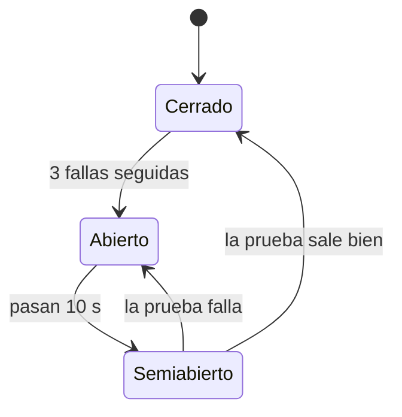

# ADR-005: Servicio externo, timeout, circuit breaker y dependencias caídas (AE2)

* **Estado:** Aceptado
* **Fecha:** 2026-09-30
* **Autor:** Juan Gualtieri (evolución individual AE2)
* **Requerimientos:** RF-8.3, RNF-08, RNF-14 (anticipado de AE4), RNF-16; alcance AE2: *"integrar o simular […] servicio externo o sandbox; aplicar timeouts y manejo explícito de error"*
* **Versión:** `m8-documentos` 2.1.0
* **Relacionados:** [ADR-003](ADR-003-backing-services-ae2.md) (decisión 2, reintentos) · [ADR-004](ADR-004-persistencia-ae2.md)

---

## Contexto

Hasta la versión 2.0.0 el servicio tenía cuatro debilidades frente a fallas:

1. **No se integraba con ningún servicio externo.** El PDF se genera localmente; la
   consigna de AE2 pide integrar o simular un servicio externo con timeouts y manejo de
   errores.
2. **Si PostgreSQL no respondía al arrancar, el proceso terminaba** (`exit 1` al fallar
   las migraciones) y el contenedor no tenía política de reinicio: quedaba caído aunque
   la base volviera.
3. **Con la base caída, la API respondía `500 INTERNAL_ERROR`**, como si fuera un error
   del servicio y no de una dependencia.
4. **Una caída de más de unos 15 s mandaba pagos válidos a la DLQ**: el consumidor
   trataba igual un mensaje con un problema que una dependencia caída, y agotaba sus 3
   reintentos de 5 s.

## Decisión 1: el servicio externo es un autorizador fiscal simulado

Antes de emitir, el servicio pide la autorización del comprobante a un autorizador
fiscal externo, que devuelve un código de 14 dígitos y su fecha de vencimiento. El
código queda guardado con el comprobante e impreso en el PDF.

| Alternativa | Por qué no |
| --- | --- |
| Almacenamiento de objetos (MinIO/S3) para el PDF | Contradice [ADR-004](ADR-004-persistencia-ae2.md): el PDF en la misma transacción que el comprobante evita huérfanos. |
| Envío del comprobante por email con un SMTP de prueba | El envío pertenece a RF-8.4 (Receipts Delivery) y RF-8.1 (Notificaciones), de otros integrantes. |
| **Autorizador fiscal simulado** | Queda dentro de RF-8.3: un comprobante electrónico se autoriza ante un organismo externo antes de emitirse. |

Características del sandbox (`modulo-8/infra/fiscal-sandbox`):

* **Contenedor propio, sin base compartida**, accesible solo por HTTP
  (`POST /v1/authorizations`). Es externo al servicio en el mismo sentido que un
  proveedor real.
* **Idempotente por `Idempotency-Key` = `tripId`.** Si el servicio reintenta después de
  un timeout (el autorizador pudo haber autorizado igual), o dos réplicas emiten el
  mismo viaje a la vez, recibe la misma autorización y no una segunda. La misma clave
  con otro importe responde `409`.
* **Solo recibe identificadores e importes** (`tripId`, `issuedAt`, `currency`, `total`):
  ningún dato personal del cliente ni del conductor sale del servicio.
* **Reglas de rechazo:** importe mayor a 10.000.000 → `422 AMOUNT_LIMIT_EXCEEDED`.
* **Modos para demostrar fallas** sin tocar el servicio: `PUT /admin/mode` con `normal`,
  `slow` (demora 5 s) o `down` (responde `503`). También se puede apagar el contenedor.

**Por qué una llamada síncrona dentro de un flujo asincrónico.** El código de
autorización va impreso en el PDF, así que la emisión necesita la respuesta para
continuar. La llamada ocurre dentro del consumidor de `payment.confirmed`: M7 ya quedó
desacoplado por la cola, y una demora del autorizador no lo afecta.

## Decisión 2: timeout y circuit breaker propios

**Timeout de 2 s por llamada** (`FISCAL_TIMEOUT_MS`, con `AbortSignal.timeout`). Sin él,
un autorizador colgado retiene indefinidamente las solicitudes HTTP y los mensajes que
el consumidor tiene tomados (`prefetch`).

**Circuit breaker** ([`src/resilience/circuit-breaker.ts`](../../src/resilience/circuit-breaker.ts)):

* **Cuenta como falla:** sin conexión, timeout, respuesta `5xx` o `429`, o respuesta con
  formato inesperado. **No cuenta** un rechazo `4xx`: demuestra que el autorizador
  funciona, aunque diga que no.
* **Abierto:** la llamada se rechaza al instante, sin esperar el timeout ni cargar a una
  dependencia que se sabe caída. La API informa en `Retry-After` cuándo reintentar.
* **Semiabierto:** deja pasar una única llamada de prueba; las demás se rechazan hasta
  conocer el resultado.
* El estado se expone en `/health/ready` (`circuits.fiscal`) y cada transición queda en
  el log.

| Alternativa | Por qué no |
| --- | --- |
| Solo timeout | Con el autorizador caído, cada pedido espera 2 s para fallar igual, y al volver recibe de golpe todos los reintentos acumulados. |
| Biblioteca (`opossum`) | Funciona, pero agrega una dependencia para unas 100 líneas y oculta la lógica que hay que poder explicar. |
| Estado del circuito compartido en Redis | Todas las réplicas verían la misma caída, a costa de acoplar el breaker a Redis. Para un breaker del lado del cliente alcanza con que cada instancia detecte la caída por su cuenta. |
| **Implementación propia, estado por instancia** | Pequeña, sin dependencias y probada con reloj simulado. |

## Decisión 3: una dependencia caída no descuenta reintentos

El consumidor clasifica los errores en tres clases:

| Clase | Ejemplos | Tratamiento |
| --- | --- | --- |
| Permanente (`PermanentMessageError`) | Sobre inválido, contenido inválido, **rechazo del autorizador** | `nack` sin reencolar: directo a la DLQ. |
| **Dependencia no disponible** (`DependencyUnavailableError`) | PostgreSQL inalcanzable, autorizador sin respuesta, **circuito abierto** | A la cola `.retry` **con el mismo contador**: espera sin gastar intentos. |
| Transitorio | Cualquier otro error inesperado | A `.retry` con el contador + 1; tras 3 intentos, a la DLQ. |

El mensaje no tiene la culpa de que la dependencia esté caída: mandarlo a la DLQ obliga
a reprocesarlo a mano aunque sea válido.

| Alternativa | Por qué no |
| --- | --- |
| Mantener la regla anterior | Una caída de 15 s manda pagos válidos a la DLQ. |
| Más reintentos o espera exponencial | Solo corre el límite: una caída más larga termina igual en la DLQ. |
| Pausar el consumidor mientras la dependencia está caída | Evita ciclos, pero exige detectar la recuperación por separado y coordinarlo con el breaker. |
| **Reintentar sin descontar** | Simple, y con el circuito abierto cada intento cuesta casi nada porque falla sin llamar a la dependencia. |

**Compromiso:** si una dependencia no vuelve nunca, el mensaje circula cada 5 s entre la
cola principal y `.retry`. Es visible en `/health/ready` (`degraded`) y en la consola
de RabbitMQ, y se detiene solo al recuperarse la dependencia.

## Decisión 4: el servicio sigue corriendo sin sus backing services

| Dependencia caída | `/health/ready` | Qué responde la API | Pagos que llegan | Recuperación |
| --- | --- | --- | --- | --- |
| PostgreSQL (crítica) | `503`, `unavailable` | `503 DATABASE_UNAVAILABLE` + `Retry-After` (antes: `500`) | Esperan en `.retry` | Automática |
| PostgreSQL **al arrancar** | `503` | Igual; `/health/live` en `200` | Se consumen al preparar el esquema | El esquema se prepara reintentando cada 3 s (`DATABASE_STARTUP_RETRY_MS`) |
| Redis | `200`, `degraded` | Solo los enlaces: `503 DOWNLOAD_LINKS_UNAVAILABLE` | Se emiten normalmente | El cliente se reconecta solo |
| RabbitMQ | `200`, `degraded` | Todo sigue funcionando | No llegan (esperan en el broker) | Reconexión cada 5 s; `receipt.issued` espera en la bandeja de salida |
| Autorizador fiscal | `200`, `degraded` | `POST` responde `503 FISCAL_SERVICE_UNAVAILABLE` + `Retry-After`; consulta y descarga siguen | Esperan en `.retry` | La primera prueba exitosa cierra el circuito |

Cambios que lo hacen posible:

* El servidor HTTP arranca **antes** que la base. El consumidor y el relay arrancan
  después de preparar el esquema, porque lo necesitan.
* El manejador de errores reconoce los errores de conexión de PostgreSQL
  ([`src/db/errors.ts`](../../src/db/errors.ts)) y responde `503` en lugar de `500`.
* `restart: unless-stopped` en Compose, como último recurso ante una terminación
  inesperada del proceso. Las caídas de dependencias no lo hacen terminar.

## Consecuencias

* **Positivas:** ninguna caída de una dependencia pierde pagos ni los manda a la DLQ; el
  servicio no se cae ni responde `500` por una dependencia; los clientes saben cuándo
  reintentar; el estado de cada dependencia y del circuito es observable.
* **Negativas:** una dependencia más que operar; sin el autorizador no se emiten
  comprobantes nuevos (es preferible a emitirlos sin autorización); el estado del
  circuito es por réplica; un mensaje puede circular indefinidamente si una dependencia
  no vuelve.
* **Hallazgo fuera del alcance:** la prueba de resiliencia mostró que el servicio de
  Soporte (RF-8.5) no se reconecta cuando RabbitMQ se reinicia: su endpoint de
  publicación falla hasta reiniciar el contenedor. Por eso esa prueba corre al final de
  `pnpm run test:e2e`.

## Evidencia

* `tests/unit/circuit-breaker.test.ts`: transiciones, umbral, prueba única en semiabierto, rechazos que no abren el circuito.
* `tests/integration/fiscal-authorizer.test.ts`: timeout, `5xx`, conexión rechazada, `422`, formato inválido, apertura y recuperación; contra el contenedor, idempotencia y autorización guardada.
* `tests/integration/payment-confirmed.consumer.test.ts`: con una dependencia caída el mensaje supera `MAX_RETRIES` sin ir a la DLQ; un rechazo fiscal va a la DLQ sin reintentos.
* `tests/unit/dependency-errors.test.ts`: detección de PostgreSQL caído y respuestas `503` / `422`.
* `modulo-8/tests/e2e/resiliencia-ae2.e2e.test.mjs`: apaga de verdad Redis, RabbitMQ, el autorizador y PostgreSQL (también al arrancar) con `docker compose stop` y verifica la recuperación. Se ejecuta con `pnpm run test:resiliencia` desde `modulo-8`.
