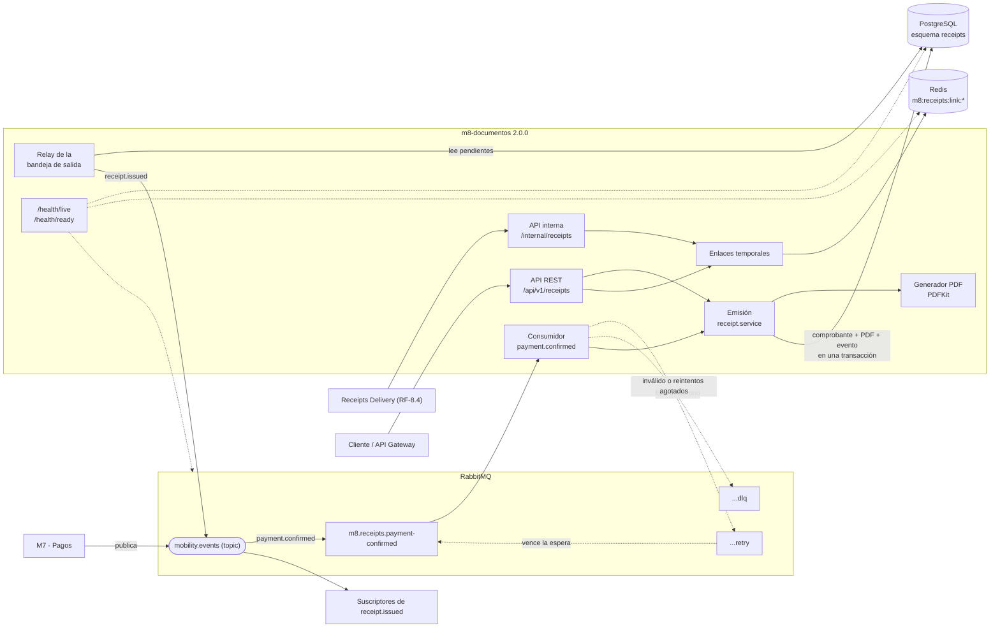
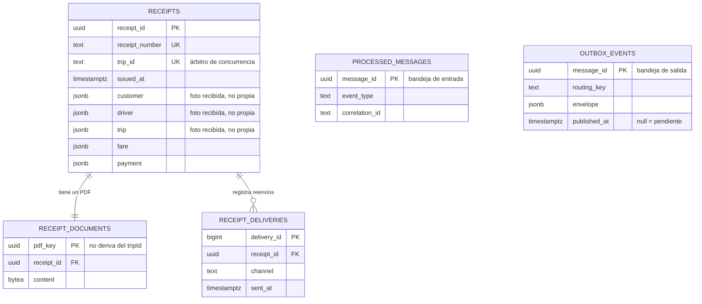
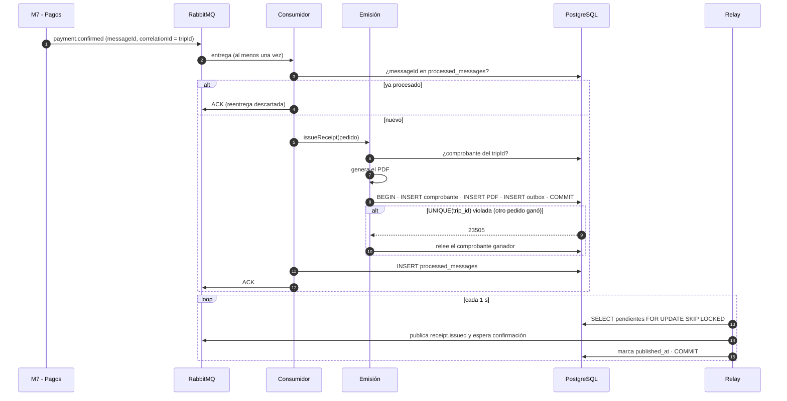
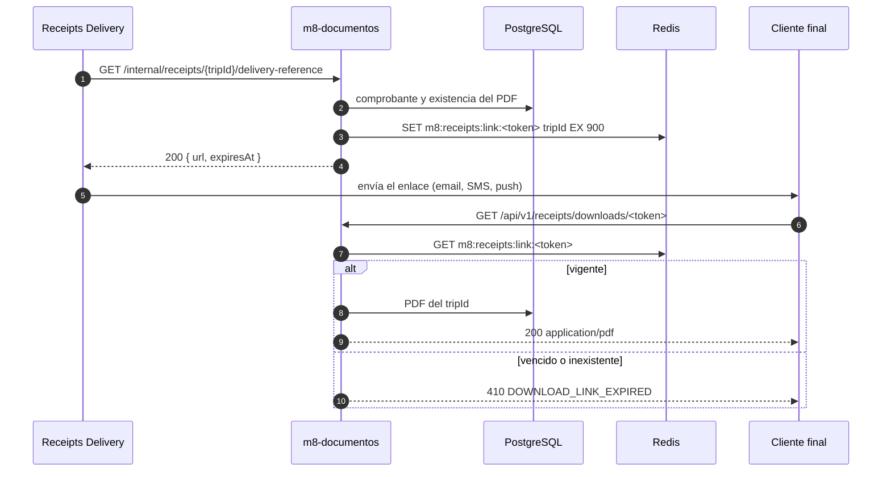

# Arquitectura del servicio de comprobantes (AE2)

Versión 2.0.0 del servicio `m8-documentos`. La arquitectura de AE1 se conserva como
evidencia en [componentes-m8.md](componentes-m8.md).

## 1. Componentes



| Componente | Responsabilidad |
| --- | --- |
| API REST | Emisión manual, consulta, descarga y reenvío. Contrato: `openapi/receipts.openapi.yaml`. |
| API interna | `delivery-reference` para Receipts Delivery. Contrato: catálogo de eventos, sección 6. |
| Consumidor | ACK manual, reintentos con cola de espera, DLQ y bandeja de entrada. |
| Emisión | Única lógica de emisión para ambos caminos; idempotente por `tripId`. |
| Relay | Publica la bandeja de salida con confirmación de RabbitMQ; `SKIP LOCKED` entre réplicas. |
| Enlaces temporales | Token opaco con TTL en Redis. |
| Health | Vitalidad sin dependencias; disponibilidad por dependencia (PostgreSQL crítica). |

## 2. Propiedad de datos



| Dato | Dueño | Cómo lo obtiene el servicio |
| --- | --- | --- |
| Comprobante, PDF, reenvíos, bandejas | **Este servicio** (esquema `receipts`, rol `m8_receipts`) | Propio |
| Pago confirmado | M7 | Evento `payment.confirmed` |
| Cliente, conductor, recorrido | M1 / M6 | Llegan en el evento (provisorio, pendiente de M7); se guardan como foto inmutable |
| Enlaces de descarga | Este servicio (Redis, efímero) | Propio; vencen solos |

Ningún otro servicio accede a estas tablas, y este servicio no accede a tablas ajenas.
Fundamento en [ADR-004](../adr/ADR-004-persistencia-ae2.md).

## 3. Secuencia: emisión asincrónica y publicación de `receipt.issued`



Si la base no responde, el consumidor republica el mensaje en la cola `.retry` (espera
de 5 s, hasta 3 veces) y después lo envía a la DLQ. Un mensaje inválido va directo a la
DLQ. Si RabbitMQ no responde, el evento queda pendiente en `outbox_events`.

## 4. Secuencia: enlace temporal de descarga



## 5. Observabilidad

Cada línea de log es un JSON con `timestamp`, `level`, `service`, `component`,
`message` y `correlationId`. El `correlationId` llega por el encabezado
`X-Correlation-Id` (o se genera) en HTTP, y por el sobre del mensaje en RabbitMQ, de
modo que un viaje se sigue de punta a punta filtrando por su `tripId`:

```bash
docker compose logs receipts --no-log-prefix | grep '"correlationId":"trip-2026-000123"'
```

Los logs no incluyen nombres, emails, destinos de envío ni tokens de descarga.
