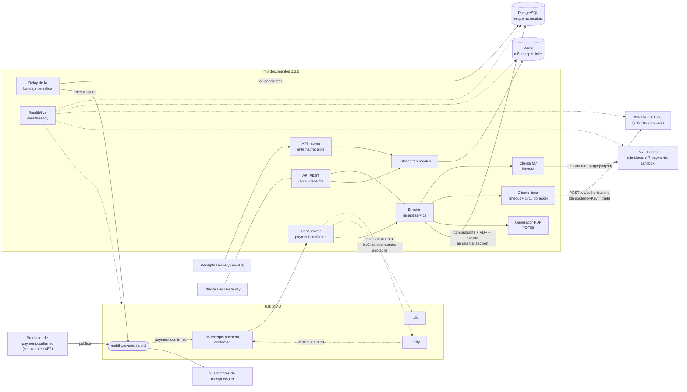
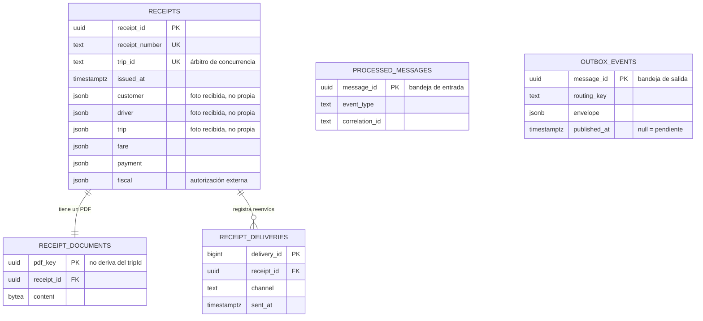
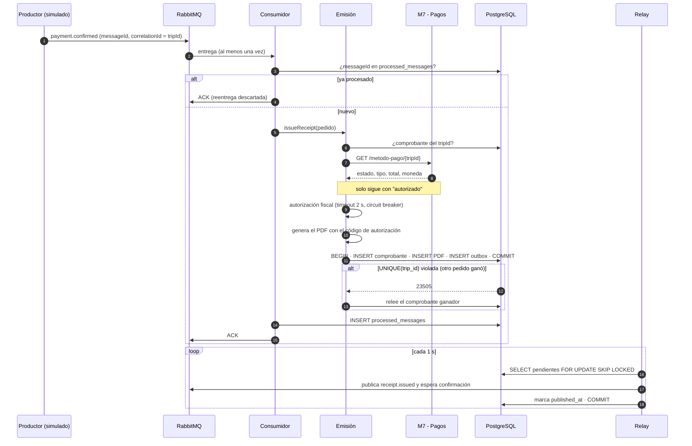
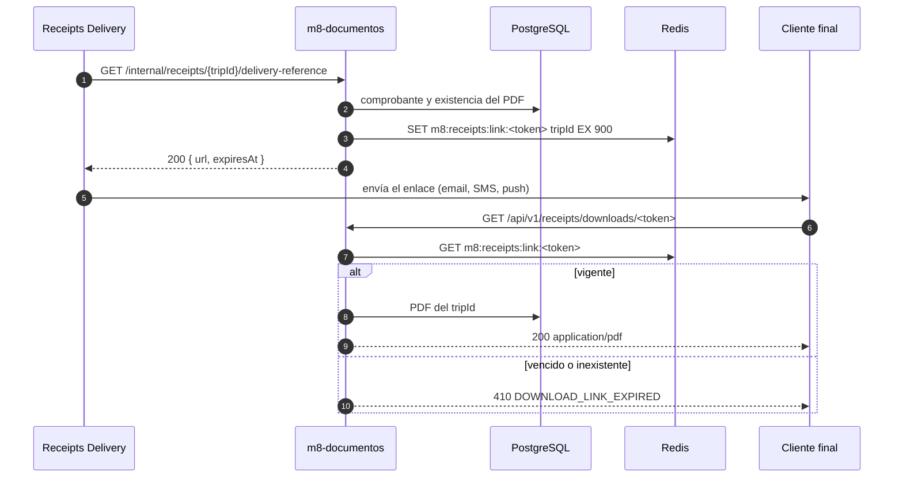

# Arquitectura del servicio de comprobantes (AE2)

Versión 2.3.0 del servicio `m8-documentos`. La arquitectura de AE1 se conserva como
evidencia en [componentes-m8.md](componentes-m8.md).

Desde la 2.2.0, M7 se integra por REST: no publica `payment.confirmed` y el servicio
le consulta el pago antes de emitir. La entrada por evento se conserva con un
productor simulado (catálogo de eventos, sección 5.1).

## 1. Componentes



| Componente | Responsabilidad |
| --- | --- |
| API REST | Emisión manual, consulta, descarga y reenvío. Contrato: `openapi/receipts.openapi.yaml`. |
| API interna | `delivery-reference` para Receipts Delivery. Contrato: catálogo de eventos, sección 6. |
| Consumidor | ACK manual, reintentos con cola de espera, DLQ y bandeja de entrada. |
| Emisión | Única lógica de emisión para ambos caminos; idempotente por `tripId`. Verifica el pago en M7 y pide la autorización fiscal antes de generar el PDF. |
| Cliente M7 | Consulta `GET /metodo-pago/{viajeId}` con timeout de 2 s y traduce estado, medio de pago e importe al modelo interno. Solo un pago autorizado habilita la emisión. |
| Cliente fiscal | Llamada al autorizador externo con timeout de 2 s y circuit breaker ([ADR-005](../adr/ADR-005-resiliencia-ae2.md)). |
| Relay | Publica la bandeja de salida con confirmación de RabbitMQ; `SKIP LOCKED` entre réplicas. |
| Enlaces temporales | Token opaco con TTL en Redis. |
| Health | Vitalidad sin dependencias; disponibilidad por dependencia (PostgreSQL crítica; Redis, RabbitMQ, fiscal y M7 no críticas) y estado del circuito. |

## 2. Propiedad de datos



| Dato | Dueño | Cómo lo obtiene el servicio |
| --- | --- | --- |
| Comprobante, PDF, reenvíos, bandejas | **Este servicio** (esquema `receipts`, rol `m8_receipts`) | Propio |
| Estado del pago, medio de pago e importe cobrado | M7 | Consulta REST `GET /metodo-pago/{viajeId}` al emitir; se guardan con el comprobante |
| Cliente, conductor, recorrido y desglose de la tarifa | M1 / M6 / M7 | Llegan en el pedido o en el evento (provisorio hasta cerrar los contratos con M1, M2, M3 y M6); se guardan como foto inmutable |
| Enlaces de descarga | Este servicio (Redis, efímero) | Propio; vencen solos |
| Autorización fiscal | Autorizador fiscal (externo) | Llamada HTTP al emitir; se guarda con el comprobante. Solo se le envían identificadores e importes |

Ningún otro servicio accede a estas tablas, y este servicio no accede a tablas ajenas.
Fundamento en [ADR-004](../adr/ADR-004-persistencia-ae2.md).

## 3. Secuencia: emisión asincrónica y publicación de `receipt.issued`



Si la base, M7 o el autorizador fiscal no responden, el consumidor republica el mensaje
en la cola `.retry` (espera de 5 s) **sin descontar intentos**, hasta que la dependencia
vuelva. Un pago pendiente o sin registrar en M7, u otro error inesperado, se reintenta
hasta 3 veces y después va a la DLQ. Un mensaje inválido, un pago rechazado por M7 o un
comprobante rechazado por el autorizador va directo a la DLQ. Si RabbitMQ no
responde, el evento queda pendiente en `outbox_events`. Detalle en
[ADR-005](../adr/ADR-005-resiliencia-ae2.md).

## 4. Secuencia: enlace temporal de descarga



## 5. Observabilidad

Cada línea de log es un JSON con `timestamp`, `level`, `service`, `component`,
`message` y `correlationId`. El `correlationId` llega por el encabezado
`X-Correlation-Id` (o se genera) en HTTP, y por el sobre del mensaje en RabbitMQ, de
modo que un viaje se sigue de punta a punta filtrando por su `tripId`:

```bash
docker compose logs receipts --no-log-prefix | grep '"correlationId":"trip-2026-000123"'
```

Los logs no incluyen nombres, emails, destinos de envío ni tokens de descarga.
